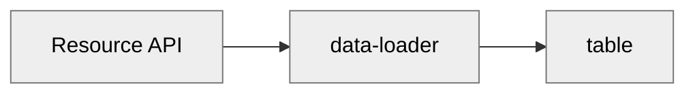

# Basic app

Each app has a name, description, and a default page. Notice the name and description have the value
that was entered in the _“Create new app”_ dialog.

## Empty app

The newly created app has two pages. On each page, an
[`action-button`](/blocks/@appsemble/action-button) block is rendered.

The icon on the button is specified in the block parameters. Because each block type has different
functionalities, they also accept different types of parameters.

Each block type may also call specific types of actions. In case of the `action-button`, the button
may be clicked. This is why it has an `onClick` event. When the button on _“Example Page A”_ is
clicked, a `link` action is called. This will link the user to _“Example Page B”_. Vice-versa,
_“Example Page B”_ has a button that links to _“Example Page A”_.

## Adding a resource

Resources allow apps to store data in the Appsemble resource API, or to map resources to somewhat
compliant third party APIs. This tutorial will focus on usage with Appsemble’s own resource API.

Add the following to the app definition at the root of the YAML:

```yaml copy
resources:
  person:
    roles: [$public]
    schema:
      type: object
      additionalProperties: false # Custom properties are disallowed to ensure the shape of each person resource is fixed.
      required:
        - firstName
        - lastName
        - email
      properties:
        firstName:
          type: string
          maxLength: 80
        lastName:
          type: string
          maxLength: 80
        email:
          type: string
          format: email
        description:
          type: string
          maxLength: 500
```

This may look daunting at first, but it’s not that complicated when given a closer look. This
specified a resource named `person`. Resources have a `schema` property. This `schema` property is a
[JSON schema](https://json-schema.org/draft/2019-09/json-schema-validation.html). Such schemes allow
complex structures, but typically this isn’t needed for resources. The person schema describes an
object which has the properties `firstName`, `lastName`, `email`, and `description`. `firstName` and
`lastName` shouldn’t be too long, whereas `email` should be a valid email address. For example, this
could represent the following data structure:

```json
{
  "firstName": "John",
  "lastName": "Smith",
  "email": "john.smith@example.com",
  "description": "This is the best smith in town."
}
```

The schema is used as a safety net for invalid data, but also for representation in some places.

When the app is published with the `resources` property, a new “Resources” menu item appears to the
side menu. This way resources can be managed in a generic way from within
[Appsemble studio](studio.md) in an administrator-like fashion.

## Displaying data

Resources exist for use it in the app. A simple way to display data is to add a `table` block. The
table block can display data in an orderly manner in a table.

Let’s replace _“Example Page A”_ and _“Example Page B”_ with a single page, named _“People”_.

```yaml copy
pages:
  - name: People
    blocks:
      - type: table
        version: 0.20.40
        events:
          listen:
            data: people
        parameters:
          fields:
            - value: { prop: firstName }
              label: First Name
            - value: { prop: lastName }
              label: Surname
```

The default page must also be changed to `People`, because the `Example Page A` has just been
removed.

```yaml copy
defaultPage: People
```

After adding this you will notice an error message mentioning that there is no matching _event
emitter_ that will submit data to the `people` event listener.

Most blocks rely on data loader block to display data. Notice the table block on the _“People”_ page
doesn’t even reference the `person` resource anywhere. It merely listens on an event called
`people`.

To actually use any data, it must be loaded. Typically this is loaded by a `data-loader` block. This
block then emits the data to other blocks on the page, such as the `table` block.



Let’s add such a `data-loader` block.

```yaml copy
pages:
  - name: People
    blocks:
      - type: data-loader
        version: 0.20.40
        actions:
          onLoad:
            type: resource.query
            resource: person
        events:
          emit:
            data: people
      - type: table
        version: 0.20.40
```

When the app is saved, it will start off by showing a spinner. It then quickly turns into some
familiar headers. The data has been loaded. However, there is no data to display, as no people have
been registered yet.

At this point, the total app definition should look like this:

```yaml copy filename="app-definition.yaml"
name: My App
defaultPage: People

resources:
  person:
    roles: [$public]
    schema:
      type: object
      additionalProperties: false
      required:
        - firstName
        - lastName
        - email
      properties:
        firstName:
          type: string
          maxLength: 80
        lastName:
          type: string
          maxLength: 80
        email:
          type: string
          format: email
        description:
          type: string
          maxLength: 500

pages:
  - name: People
    blocks:
      - type: data-loader
        version: 0.20.40
        actions:
          onLoad:
            type: resource.query
            resource: person
        events:
          emit:
            data: people
      - type: table
        version: 0.20.40
        events:
          listen:
            data: people
        parameters:
          fields:
            - value: { prop: firstName }
              label: First Name
            - value: { prop: lastName }
              label: Surname
```

## Creating data

The easiest way to create new data is through a form. This is exactly what we’ll be creating next.

Add a new page:

```yaml copy
- name: Register
  blocks:
    - type: form
      version: 0.20.40
      actions:
        onSubmit:
          type: resource.create
          resource: person
          onSuccess:
            type: link
            to: People
      parameters:
        fields:
          - name: firstName
            type: string
            label: First Name
            requirements:
              - required: true
                errorMessage: This field is required
              - maxLength: 80
          - name: lastName
            type: string
            label: Surname
            requirements:
              - required: true
                errorMessage: This field is required
              - maxLength: 80
          - name: email
            type: string
            label: Email Address
            for